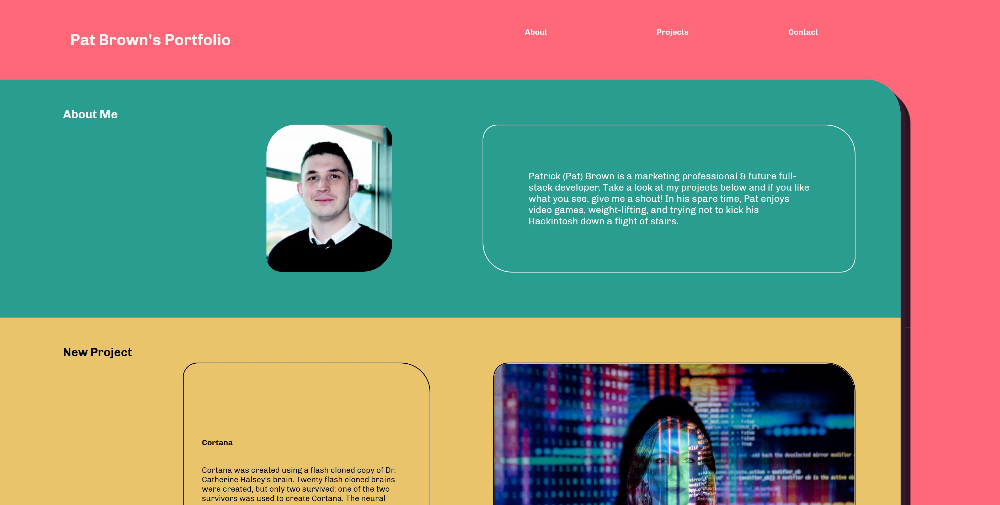

# <02-HTML-CSS-Portfolio>

## Description

A deployed portfolio page so a potential employer can see my work and samples, as well as resume (eventually).

During the creation of this page from scratch, I learned a great deal about code organization. After building the initial site draft, I started diving into the CSS without a roadmap which lead me straight off a figurative cliff into confusion. With lessons learned, I began again with a plan (and wireframe!) in mind and was eventually able to deploy a working site where I knew where to go in order to troubleshoot.

I also developed a lot of hands-on experience (and newfound appreciation) with the flexbox model, which I had not experienced before this boot camp.

## Installation & Access

To access the project, visit my [GitHub Pages](https://patrickbrown-io.github.io/02-HTML-CSS-PB-Porfolio/)

## Usage

I am available for content-creation, web-development, brand identity and more. You are welcome to forward this to any member(s) of your organization responsible for hiring outreach.

## Credits

[Patrick Brown](https://github.com/patrickbrown-io)

## Features

CSS - Flexbox

## How to Contribute

Feel free to help me add to my projects list-- I am open to work.
